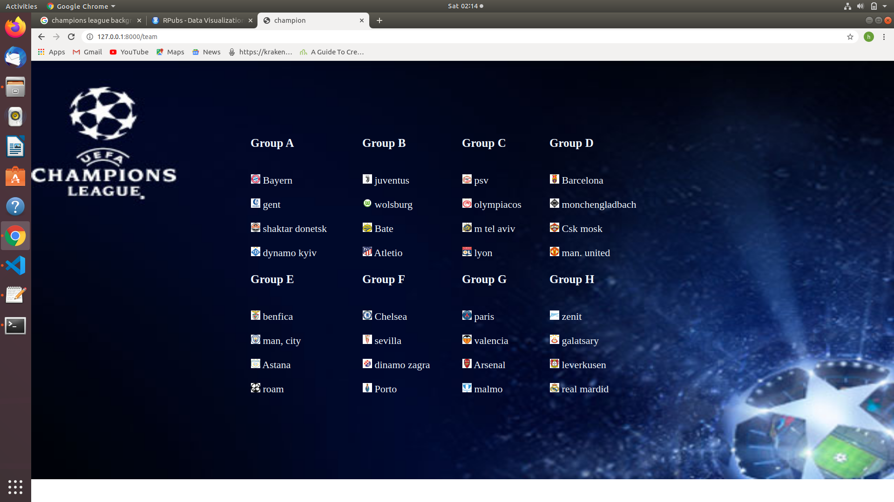

# Installation process:
1. mkdir assignment
2. make a virtual enviroment
3. activate virtual enviroment.
4. cd /project
5. use git clone <url for .git>
6. pip install -r requirements.txt
9. load fixture using : python manage.py loaddata /fixtures/initial_data.json
10. start the server

# PixelVide
Random Team genarator
I have created this RANDOM TEAM GENERATOR USING:
frontend : HTML , CSS , javascript 
backend : Django(python) 
Database : sqlite

